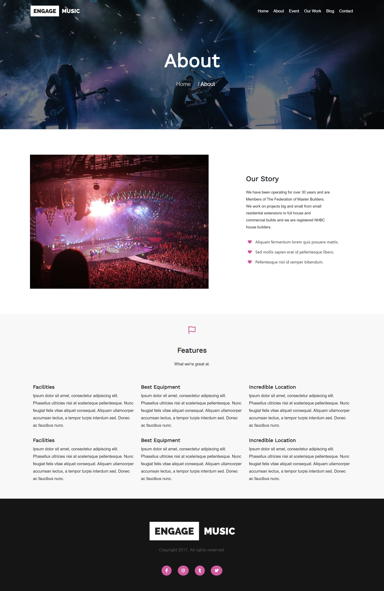
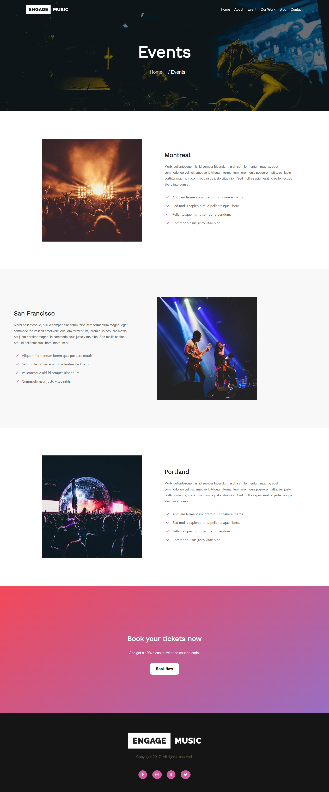
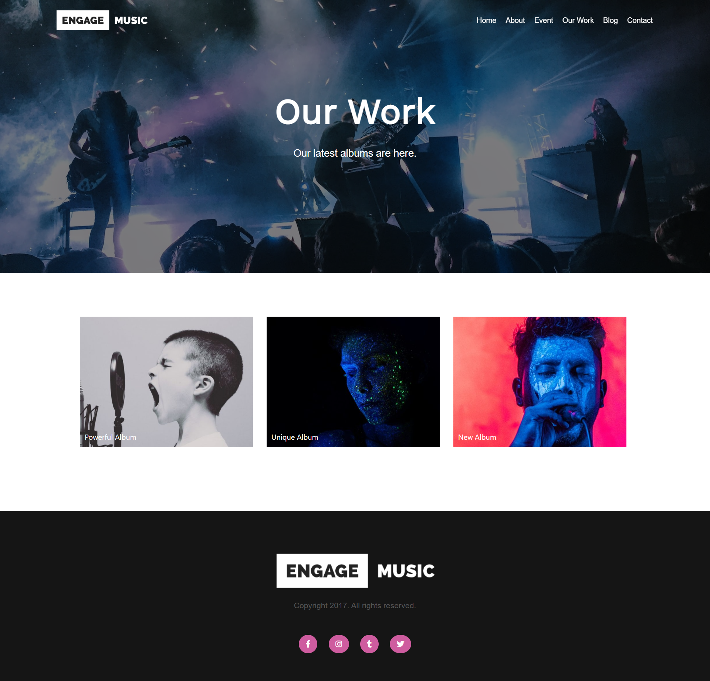

# 📌 MusicCompany Website

## ✨ Project Overview
This project is a dynamic and user-friendly web application  .  
The goal was to create an interactive, visually appealing, and responsive interface that enhances user experience and improves workflow efficiency.

I'm immensely proud of the end result and the value it has brought to users. This project serves as a testament to my proficiency in JavaScript, Bootstrap, and jQuery, demonstrating my ability to craft compelling and functional web applications.
 
---

## 👨‍💻 Technologies Used
- **HTML**
- **CSS**
---
🔗 **Live Demo:** https://www.engage.veented.com/music/  

## 📸 Pages Preview  
Below are previews of the main pages used in the project.  
 
### 🏠 Home Page  

 
### 🏠 About Page  

### 🏠 Event Page  

### 🏠 OurWork Page  

